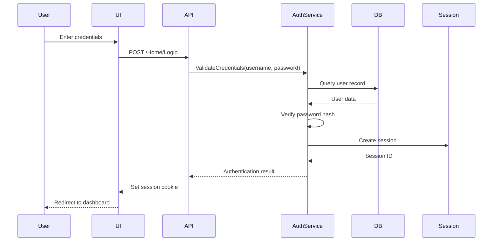
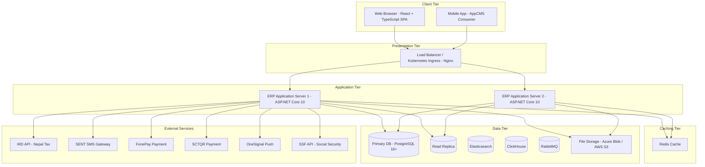

# Design Document: Ultimate ERP System

## Overview

The Ultimate ERP System is a comprehensive enterprise resource planning solution designed to manage all aspects of business operations across multiple industries. The system encompasses 16+ major modules including Account, Inventory, HR, Assets Management, Lab, Dashboard, Security, Hospital Management (HMS), Service, Task, Finance/Loan, AppCMS, Support, Loyalty, Manufacturing/Production, and Setup.

### System Scope

The system manages:
- **721 pages** of user interface functionality
- **97 API endpoints** for backend operations
- **426 data entities** across all modules
- **1441 forms** for data entry
- **2026 tables** for data display
- **Multi-branch and multi-currency** operations
- **Nepal-specific compliance** (IRD certification, Bikram Sambat calendar)

### Key Business Objectives

1. **Unified Business Management**: Provide a single platform for managing accounting, inventory, HR, assets, and specialized industry workflows
2. **Regulatory Compliance**: Meet Nepal IRD requirements with real-time reporting and dual calendar support (Gregorian and Bikram Sambat)
3. **Multi-Branch Operations**: Support distributed operations with branch-wise inventory, accounting, and consolidated reporting
4. **Industry Flexibility**: Support specialized workflows for hospitals, service centers, dairy, petrol pumps, tea procurement, and vehicle financing
5. **Scalability**: Handle 100+ concurrent users with responsive performance
6. **Data Integrity**: Maintain strict validation, audit trails, and referential integrity across all transactions

### Technology Stack

**Backend:**
- ASP.NET Core 10 (C#) — application framework
- Entity Framework Core — ORM for relational data access
- Dapper — high-performance raw SQL queries
- CQRS + MediatR — command/query separation and in-process messaging
- FluentValidation — model and command validation
- AutoMapper — object-to-object mapping
- Hangfire — background job scheduling and processing

**Database & Storage:**
- PostgreSQL 16+ — primary relational database
- Redis — distributed cache (StackExchange.Redis)
- Elasticsearch — full-text search and log aggregation
- ClickHouse — high-volume analytics and large-scale reporting

**API Layer:**
- REST APIs (ASP.NET Core) — JSON responses with `{Data, TotalCount, IsSuccess, ResponseMSG}`
- GraphQL (Hot Chocolate) — flexible query API for complex data fetching
- SignalR — real-time bidirectional communication
- gRPC — high-performance inter-service communication

**Messaging:**
- MassTransit — event bus abstraction and saga orchestration
- RabbitMQ — message broker

**Frontend:**
- React + TypeScript — component-based UI framework
- Ant Design — enterprise UI component library
- Redux Toolkit — global state management
- Apache ECharts — charts and data visualization

**Security:**
- Keycloak — authentication and identity & access management (IAM)
- ASP.NET Core Policies — authorization policies and role enforcement
- JWT + Refresh Tokens — stateless token-based authentication

**DevOps & Infrastructure:**
- Docker — containerization
- Kubernetes — container orchestration
- Microsoft Azure or AWS — cloud provider
- GitHub Actions — CI/CD pipelines
- Terraform — infrastructure as code

**Monitoring & Observability:**
- Serilog → Elasticsearch — structured logging pipeline
- Prometheus — metrics collection
- Grafana — dashboards and alerting
- OpenTelemetry — distributed tracing

## Architecture

### System Architecture Diagram

```mermaid
graph TB
    subgraph "Presentation Layer"
        UI[Web Browser]
        React[React + TypeScript]
        AntDesign[Ant Design Components]
        Redux[Redux Toolkit]
        ECharts[Apache ECharts]
    end
    
    subgraph "API Layer"
        API[REST / GraphQL / gRPC Gateway]
        Auth[Keycloak IAM]
        AuthZ[ASP.NET Core Policies]
        SignalRHub[SignalR Hub]
    end
    
    subgraph "Business Logic Layer"
        AccountSvc[Account Service]
        InventorySvc[Inventory Service]
        HRSvc[HR Service]
        AssetsSvc[Assets Service]
        LabSvc[Lab Service]
        HMSSvc[HMS Service]
        ServiceSvc[Service Management]
        TaskSvc[Task Service]
        FinanceSvc[Finance/Loan Service]
        AppCMSSvc[AppCMS Service]
        SupportSvc[Support Service]
        LoyaltySvc[Loyalty Service]
        DashboardSvc[Dashboard Service]
        ReportSvc[Report Service]
    end
    
    subgraph "Data Access Layer"
        Repositories[Repository Pattern]
        UnitOfWork[Unit of Work]
        QueryBuilder[Query Builder]
    end
    
    subgraph "Data Layer"
        DB[(PostgreSQL 16+)]
        Cache[(Redis Cache)]
        Search[(Elasticsearch)]
        Analytics[(ClickHouse)]
        MQ[(RabbitMQ)]
    end
    
    subgraph "External Integrations"
        IRD[IRD API - Nepal Tax]
        SMS[SMS Gateway]
        Payment[Payment Gateway]
        OneSignal[Push Notifications]
        Tally[Tally Integration]
    end
    
    UI --> React
    React --> AntDesign
    React --> Redux
    React --> API
    React --> SignalRHub
    
    API --> Auth
    API --> AuthZ
    Auth --> Session
    
    API --> AccountSvc
    API --> InventorySvc
    API --> HRSvc
    API --> AssetsSvc
    API --> LabSvc
    API --> HMSSvc
    API --> ServiceSvc
    API --> TaskSvc
    API --> FinanceSvc
    API --> AppCMSSvc
    API --> SupportSvc
    API --> LoyaltySvc
    API --> DashboardSvc
    API --> ReportSvc
    
    AccountSvc --> Repositories
    InventorySvc --> Repositories
    HRSvc --> Repositories
    AssetsSvc --> Repositories
    LabSvc --> Repositories
    HMSSvc --> Repositories
    ServiceSvc --> Repositories
    TaskSvc --> Repositories
    FinanceSvc --> Repositories
    AppCMSSvc --> Repositories
    SupportSvc --> Repositories
    LoyaltySvc --> Repositories
    DashboardSvc --> Repositories
    ReportSvc --> Repositories
    
    Repositories --> UnitOfWork
    UnitOfWork --> DB
    Repositories --> Cache
    Repositories --> Search
    ReportSvc --> Analytics
    AccountSvc --> MQ
    InventorySvc --> MQ
    
    AccountSvc --> IRD
    API --> SMS
    API --> Payment
    API --> OneSignal
    AccountSvc --> Tally
    InventorySvc --> Tally
```



### Architectural Patterns

**1. Three-Tier Architecture**
- **Presentation Tier**: React + TypeScript SPA with Ant Design, Redux Toolkit, and Apache ECharts
- **Application Tier**: ASP.NET Core 10 API exposing REST, GraphQL (Hot Chocolate), SignalR, and gRPC endpoints
- **Data Tier**: PostgreSQL primary database with Redis cache, Elasticsearch for search/logs, and ClickHouse for analytics

**2. Repository Pattern**
- Abstracts data access logic
- Provides consistent CRUD operations across all entities
- Enables unit testing with mock repositories

**3. Unit of Work Pattern**
- Manages database transactions
- Ensures atomic operations across multiple repositories
- Handles commit/rollback logic

**4. Service Layer Pattern**
- Encapsulates business logic
- Coordinates operations across multiple repositories
- Enforces business rules and validation

**5. API Gateway Pattern**
- Single entry point for all client requests
- Handles authentication and authorization
- Routes requests to appropriate services

### Module Relationships

```mermaid
graph LR
    Security[Security Module] --> Account[Account Module]
    Security --> Inventory[Inventory Module]
    Security --> HR[HR Module]
    Security --> Assets[Assets Module]
    Security --> Lab[Lab Module]
    Security --> HMS[HMS Module]
    Security --> Service[Service Module]
    Security --> Task[Task Module]
    Security --> Finance[Finance Module]
    Security --> AppCMS[AppCMS Module]
    Security --> Support[Support Module]
    Security --> Loyalty[Loyalty Module]
    
    Account --> Inventory
    Account --> HMS
    Account --> Service
    Account --> Finance
    
    Inventory --> HMS
    Inventory --> Service
    Inventory --> Finance
    
    Dashboard[Dashboard Module] --> Account
    Dashboard --> Inventory
    Dashboard --> HR
    Dashboard --> Assets
    Dashboard --> HMS
    Dashboard --> Service
    Dashboard --> Finance
    
    Setup[Setup Module] --> Security
    Setup --> Account
    Setup --> Inventory
```



## Components and Interfaces

### Frontend Components Structure

**Layout Components:**
- `MainLayout`: App shell with Ant Design Layout (Sider, Header, Content)
- `Sidebar`: Navigation menu with module grouping using Ant Design Menu
- `Navbar`: Top bar with user profile, notifications, and quick actions
- `Footer`: Copyright and version information

**Page Components:**
- `ListPage`: Standard list view with Ant Design Table, search, filters, pagination
- `FormPage`: Create/edit form with Ant Design Form, FluentValidation-backed validation, save/cancel actions
- `DetailPage`: Read-only view of entity details
- `DashboardPage`: Widget-based dashboard with Apache ECharts charts and KPI cards
- `ReportPage`: Report viewer with parameters and export options

**Form Components:**
- `TextInput`: Standard Ant Design Input with validation
- `NumberInput`: Ant Design InputNumber with decimal precision control
- `DatePicker`: Ant Design DatePicker with BS/AD calendar support
- `SelectDropdown`: Ant Design Select with remote search capability
- `FileUpload`: Ant Design Upload with preview and validation
- `DataGrid`: Editable Ant Design Table for line items (voucher details, invoice lines)

**Modal Components:**
- `ConfirmDialog`: Ant Design Modal confirmation for delete/submit actions
- `LookupModal`: Entity lookup with search and selection
- `DetailModal`: Quick view of entity details without navigation
- `ErrorModal`: Error message display with details

### Backend API Structure

**Controllers:**
- Handle HTTP requests and responses
- Validate request parameters
- Call appropriate service methods
- Return standardized JSON responses

**Services:**
- Implement business logic
- Coordinate operations across repositories
- Enforce business rules and validation
- Handle transactions

**Repositories:**
- Provide data access methods
- Execute database queries
- Map database records to domain objects
- Handle database-specific operations

**API Response Structure:**
```json
{
  "Data": <entity or array of entities>,
  "TotalCount": <number of records>,
  "IsSuccess": <boolean>,
  "ResponseMSG": <success or error message>
}
```

### Security Components

**Authentication Flow:**


**Authorization Components:**
- `PermissionChecker`: Validates user permissions for entities and operations
- `BranchAccessFilter`: Enforces branch-wise access restrictions
- `GodownAccessFilter`: Enforces godown-wise access restrictions
- `CostCenterAccessFilter`: Enforces cost center-wise access restrictions
- `LedgerGroupAccessFilter`: Enforces ledger group-wise access restrictions
- `ProductGroupAccessFilter`: Enforces product group-wise access restrictions

### Integration Interfaces

**IRD Integration (Nepal Tax Authority):**
- `IRDApiClient`: HTTP client for IRD API calls
- `IRDDataMapper`: Maps ERP transactions to IRD format
- `IRDLogger`: Logs all IRD API requests and responses
- Endpoints: Sales submission, Purchase submission, Stock submission

**SMS Gateway Integration:**
- `SMSProvider`: Abstract interface for SMS providers
- `SMSLogger`: Logs all SMS API calls
- Configuration: SENT rules for automated SMS triggers

**Payment Gateway Integration:**
- `PaymentGatewayProvider`: Abstract interface for payment gateways
- `FonePayProvider`: FonePay QR code payment implementation
- `SCTQRProvider`: SCTQR payment implementation

**Tally Integration:**
- `TallyXMLParser`: Parses Tally XML export files
- `TallyDataImporter`: Imports masters and transactions from Tally
- `TallyXMLExporter`: Exports data in Tally-compatible XML format

## Data Models

### Core Entity Patterns

All entities follow these common patterns:

**Base Entity Fields:**
```
- Id (Primary Key)
- Code (Unique identifier)
- Name
- Alias
- BDId (Business Domain ID)
- CUserId (Created User ID)
- CreatedDate
- ModifiedBy
- ModifiedDate
- IsActive
- IsDeleted (Soft delete flag)
```

**Audit Fields:**
```
- CreatedBy
- CreatedDate
- ModifiedBy
- ModifiedDate
```

**Branch-Aware Entities:**
```
- BranchId
- BranchName
- BranchCode
```

### Account Module Entities

**Ledger:**
```
LedgerId (PK)
LedgerGroupId (FK)
Code
Name
Alias
OpeningBalance
DebitAmount
CreditAmount
ClosingBalance
LedgerType (Debtor/Creditor/Bank/Cash/General)
CategoryId (FK)
ChannelId (FK)
CreditLimit
CreditDays
PANNumber
VATNumber
Address
ContactPerson
Phone
Email
IsBillWise
CostCenterId (FK)
IsActive
```

**LedgerGroup:**
```
LedgerGroupId (PK)
ParentGroupId (FK - self-reference)
Code
Name
NatureOfGroup (Asset/Liability/Income/Expense)
TypeOfGroup
IsDebtor
ShowInLedgerMaster
NumberingMethod
Prefix
Suffix
NumericalPartWidth
StartNumber
IsActive
InBuilt
```

**Voucher:**
```
VoucherId (PK)
VoucherTypeId (FK)
VoucherNumber
VoucherDate
VoucherDateBS (Bikram Sambat)
EffectiveDate
ReferenceNumber
CostClassId (FK)
BranchId (FK)
CommonNarration
TotalDebit
TotalCredit
IsAuthorized
AuthorizedBy
AuthorizedDate
IsPosted
PostedDate
IsCancelled
CancelledBy
CancelledDate
CancelReason
```

**VoucherDetail:**
```
VoucherDetailId (PK)
VoucherId (FK)
LineNumber
LedgerId (FK)
DebitAmount
CreditAmount
Narration
CostCenterId (FK)
CurrencyId (FK)
ExchangeRate
ProjectId (FK)
```

**Customer (Debtor):**
```
CustomerId (PK)
LedgerId (FK)
DebtorTypeId (FK)
Code
Name
Address
City
State
Country
Phone
Email
ContactPerson
DebtorRouteId (FK)
SalesAgentId (FK)
AreaId (FK)
ClusterId (FK)
CreditGroupId (FK)
CreditLimit
CreditDays
PricingGroupId (FK)
IsActive
IsPending
```

**Vendor (Creditor):**
```
VendorId (PK)
LedgerId (FK)
Code
Name
Address
City
State
Country
Phone
Email
ContactPerson
PANNumber
VATNumber
PaymentTermsId (FK)
IsActive
```

**PDC (Post-Dated Cheque):**
```
PDCId (PK)
VoucherId (FK)
ChequeNumber
ChequeDate
ChequeDateBS
BankName
BankBranch
Amount
LedgerId (FK)
Status (Pending/Cleared/Bounced/Cancelled)
ClearedDate
```

**ODC (Open-Dated Cheque):**
```
ODCId (PK)
VoucherId (FK)
ChequeNumber
BankName
BankBranch
Amount
LedgerId (FK)
Status
```

**BankGuarantee:**
```
BankGuaranteeId (PK)
GuaranteeNumber
GuaranteeAmount
IssuingBank
ValidFrom
ValidTo
LedgerId (FK)
Purpose
Status
```

**LetterOfCredit:**
```
LCId (PK)
LCNumber
OpeningDate
ExpiryDate
AmountInFC (Foreign Currency)
LCCurrencyId (FK)
BankId (FK)
VendorId (FK)
ShipmentTerms
Purpose
Description
Status (Open/PartiallyUtilized/Utilized/Expired/Cancelled)
VoucherId (FK)
```

### Inventory Module Entities

**Product:**
```
ProductId (PK)
Code
Name
Alias
ProductTypeId (FK)
ProductGroupId (FK)
ProductCategoryId (FK)
BrandId (FK)
CompanyId (FK)
DivisionId (FK)
ColorId (FK)
FlavourId (FK)
ShapeId (FK)
UnitId (FK)
CostingMethod (FIFO/LIFO/WeightedAverage/StandardCost)
StandardCost
MRP
WholesaleRate
RetailRate
OpeningStock
OpeningValue
ReorderLevel
MaximumLevel
IsActive
IsBatchTracked
IsExpiryTracked
IsSerialTracked
HSNCode
TaxRate
```

**ProductGroup:**
```
ProductGroupId (PK)
ParentGroupId (FK - self-reference)
Code
Name
IsActive
```

**Godown:**
```
GodownId (PK)
ParentGodownId (FK - self-reference)
Code
Name
Address
GodownType
IsActive
```

**Rack:**
```
RackId (PK)
GodownId (FK)
Code
Name
Location
IsActive
```

**Stock:**
```
StockId (PK)
ProductId (FK)
GodownId (FK)
BatchNumber
ExpiryDate
Quantity
Rate
Value
RackId (FK)
```

**PurchaseInvoice:**
```
PurchaseInvoiceId (PK)
InvoiceNumber
InvoiceDate
InvoiceDateBS
VendorId (FK)
GodownId (FK)
BranchId (FK)
CostClassId (FK)
ReferenceNumber
TotalAmount
DiscountAmount
TaxAmount
NetAmount
PaymentTermsId (FK)
IsPosted
PostedDate
VoucherId (FK)
```

**PurchaseInvoiceDetail:**
```
PurchaseInvoiceDetailId (PK)
PurchaseInvoiceId (FK)
LineNumber
ProductId (FK)
Quantity
Rate
Amount
DiscountPercent
DiscountAmount
TaxPercent
TaxAmount
NetAmount
BatchNumber
ExpiryDate
RackId (FK)
```

**SalesInvoice:**
```
SalesInvoiceId (PK)
InvoiceNumber
InvoiceDate
InvoiceDateBS
CustomerId (FK)
GodownId (FK)
BranchId (FK)
CostClassId (FK)
SalesAgentId (FK)
ReferenceNumber
TotalAmount
DiscountAmount
TaxAmount
NetAmount
PaymentTermsId (FK)
IsPosted
PostedDate
VoucherId (FK)
```

**SalesInvoiceDetail:**
```
SalesInvoiceDetailId (PK)
SalesInvoiceId (FK)
LineNumber
ProductId (FK)
Quantity
Rate
Amount
DiscountPercent
DiscountAmount
TaxPercent
TaxAmount
NetAmount
BatchNumber
CostAmount
ProfitAmount
```

**StockTransfer:**
```
StockTransferId (PK)
TransferNumber
TransferDate
FromGodownId (FK)
ToGodownId (FK)
BranchId (FK)
CostClassId (FK)
TotalQuantity
TotalValue
IsPosted
PostedDate
```

**StockJournal:**
```
StockJournalId (PK)
JournalNumber
JournalDate
GodownId (FK)
BranchId (FK)
CostClassId (FK)
JournalType (Adjustment/Damage/Consumption)
Narration
IsPosted
PostedDate
```

**ProductionOrder:**
```
ProductionOrderId (PK)
OrderNumber
OrderDate
OrderDateBS
FinishedProductId (FK)
BOMId (FK)
PlannedQuantity
ProducedQuantity
GodownId (FK)
BranchId (FK)
CostClassId (FK)
Status (Pending/InProgress/Completed/Cancelled)
StartDate
CompletionDate
```

**Indent:**
```
IndentId (PK)
IndentNumber
IndentDate
IndentDateBS
RequestedByEmployeeId (FK)
GodownId (FK)
BranchId (FK)
Remarks
Status (Pending/Approved/Rejected/Fulfilled)
```

**IndentDetail:**
```
IndentDetailId (PK)
IndentId (FK)
LineNumber
ProductId (FK)
RequestedQuantity
ApprovedQuantity
Remarks
```

**StockDemand:**
```
StockDemandId (PK)
DemandNumber
DemandDate
JobCardId (FK)
GodownId (FK)
BranchId (FK)
CostClassId (FK)
Status (Pending/Issued/PartiallyIssued)
```

**DispatchOrder:**
```
DispatchOrderId (PK)
DispatchNumber
DispatchDate
DispatchDateBS
CustomerId (FK)
GodownId (FK)
BranchId (FK)
CostClassId (FK)
Status (Pending/Dispatched/Delivered/Cancelled)
```

**DispatchSection:**
```
DispatchSectionId (PK)
DispatchOrderId (FK)
SalesInvoiceId (FK)
ProductId (FK)
Quantity
GodownId (FK)
```

**GatePass:**
```
GatePassId (PK)
GatePassNumber
GatePassDate
GatePassDateBS
GatePassType (Inward/Outward)
PartyName
VehicleNumber
Purpose
Description
GodownId (FK)
BranchId (FK)
IsApproved
ApprovedBy
```

**SalesAllotment:**
```
SalesAllotmentId (PK)
AllotmentNumber
AllotmentDate
CustomerId (FK)
ProductId (FK)
AllottedQuantity
DeliveredQuantity
GodownId (FK)
Status (Pending/PartiallyDelivered/Delivered/Cancelled)
```

**BOM (Bill of Materials):**
```
BOMId (PK)
ProductId (FK - Finished Good)
BOMDate
IsActive
TotalCost
```

**BOMDetail:**
```
BOMDetailId (PK)
BOMId (FK)
LineNumber
ComponentProductId (FK)
Quantity
UnitId (FK)
Rate
Amount
```

### HR Module Entities

**Employee:**
```
EmployeeId (PK)
EmployeeCode
FirstName
MiddleName
LastName
DateOfBirth
Gender
MaritalStatus
Address
City
State
Country
Phone
Email
JoiningDate
DesignationId (FK)
DepartmentId (FK)
BranchId (FK)
BankAccountNumber
BankName
BankBranch
PANNumber
IsActive
```

**Attendance:**
```
AttendanceId (PK)
EmployeeId (FK)
AttendanceDate
AttendanceDateBS
CheckInTime
CheckOutTime
WorkingHours
Status (Present/Absent/Leave/Holiday)
Remarks
```

**Leave:**
```
LeaveId (PK)
EmployeeId (FK)
LeaveTypeId (FK)
FromDate
ToDate
TotalDays
Reason
Status (Pending/Approved/Rejected)
ApprovedBy
ApprovedDate
```

**ExpenseClaim:**
```
ExpenseClaimId (PK)
EmployeeId (FK)
ClaimDate
TotalAmount
Status (Pending/Approved/Rejected/Paid)
ApprovedBy
ApprovedDate
PaidDate
```

### Assets Module Entities

**AssetMaster:**
```
AssetId (PK)
AssetCode
AssetName
AssetTypeId (FK)
AssetGroupId (FK)
AssetCategoryId (FK)
PurchaseDate
PurchaseValue
VendorId (FK)
SerialNumber
Location
Status (Available/Issued/Damaged/Repair/Disposed)
IsActive
```

**AssetIssue:**
```
AssetIssueId (PK)
AssetId (FK)
EmployeeId (FK)
IssueDate
IssueDateBS
Remarks
ReturnDate
IsReturned
```

**AssetTransfer:**
```
AssetTransferId (PK)
AssetId (FK)
FromEmployeeId (FK)
ToEmployeeId (FK)
TransferDate
Remarks
```

### Lab Module Entities

**SampleCollection:**
```
SampleCollectionId (PK)
SampleNumber
CollectionDate
CollectionDateBS
PatientName
PatientAge
PatientGender
PatientContact
DoctorName
TestParameters
Status (Pending/Completed)
```

**LabReport:**
```
LabReportId (PK)
SampleCollectionId (FK)
ReportDate
ReportDateBS
TemplateId (FK)
ReportData (JSON)
GeneratedBy
```

### HMS (Hospital Management) Module Entities

**Patient:**
```
PatientId (PK)
PatientNumber
FirstName
MiddleName
LastName
DateOfBirth
Gender
Address
City
Phone
Email
EthnicityId (FK)
DisabilityId (FK)
RegistrationDate
```

**OPDTicket:**
```
OPDTicketId (PK)
TicketNumber
TicketDate
PatientId (FK)
DoctorId (FK)
OPDTicketTypeId (FK)
OPDServiceTypeId (FK)
Symptoms
Diagnosis
Prescription
Amount
Status
```

**IPDAdmission:**
```
IPDAdmissionId (PK)
AdmissionNumber
AdmissionDate
PatientId (FK)
DoctorId (FK)
AdmissionTypeId (FK)
BedId (FK)
Diagnosis
Status (Admitted/Discharged)
DischargeDate
DischargeTypeId (FK)
```

**Bed:**
```
BedId (PK)
BedNumber
WardId (FK)
RoomId (FK)
FloorId (FK)
BuildingTypeId (FK)
BedType
Status (Available/Occupied/Maintenance)
```

### Service Module Entities

**ComplaintTicket:**
```
ComplaintTicketId (PK)
TicketNumber
TicketDate
CustomerId (FK)
DeviceId (FK)
ComplaintDescription
TicketForId (FK)
NatureId (FK)
SourceId (FK)
Priority
Status (Open/Assigned/InProgress/Resolved/Closed)
```

**JobCard:**
```
JobCardId (PK)
JobCardNumber
JobCardDate
ComplaintTicketId (FK)
JobTypeId (FK)
JobCardTypeId (FK)
AssignedToId (FK - Employee)
EstimatedCost
ActualCost
Status (Pending/InProgress/Completed/Cancelled)
CompletionDate
```

**SparePartsDemand:**
```
SparePartsDemandId (PK)
JobCardId (FK)
DemandDate
ProductId (FK)
Quantity
Status (Pending/Issued/Returned)
```

### Task Module Entities

**Task:**
```
TaskId (PK)
TaskTitle
TaskDescription
TaskTypeId (FK)
AssignedToId (FK - User)
AssignedById (FK - User)
DueDate
DueDateBS
Priority
Status (Pending/InProgress/Completed/Cancelled)
CompletionDate
```

### Finance/Loan Module Entities

**Loan:**
```
LoanId (PK)
LoanNumber
LoanDate
BorrowerName
BorrowerContact
PrincipalAmount
InterestRate
TenureMonths
DisbursementDate
EMIAmount
Status (Active/Closed/Defaulted)
VehicleDetailId (FK)
```

**LoanEMI:**
```
LoanEMIId (PK)
LoanId (FK)
EMINumber
EMIDueDate
EMIAmount
PrincipalAmount
InterestAmount
PaidAmount
PaidDate
Status (Pending/Paid/Overdue)
```

**VehicleDetail:**
```
VehicleDetailId (PK)
RegistrationNumber
ChassisNumber
EngineNumber
Model
Type
Color
ManufacturingYear
PurchaseDate
PurchaseValue
```

### AppCMS Module Entities

**Slider:**
```
SliderId (PK)
Title
ImagePath
LinkURL
DisplayOrder
IsActive
ValidFrom
ValidTo
```

**Banner:**
```
BannerId (PK)
Title
ImagePath
LinkURL
DisplayOrder
IsActive
ValidFrom
ValidTo
```

**Notice:**
```
NoticeId (PK)
Title
Content
PublishDate
ExpiryDate
IsActive
```

### Support Module Entities

**SupportTicket:**
```
SupportTicketId (PK)
TicketNumber
TicketDate
Subject
Description
Priority
Status (Open/InProgress/Resolved/Closed)
AssignedToId (FK - Support Executive)
CreatedById (FK - User)
ResolutionNotes
ResolvedDate
```

### Loyalty Module Entities

**MembershipPoint:**
```
MembershipPointId (PK)
CustomerId (FK)
TransactionDate
TransactionType (Earn/Redeem)
Points
SalesInvoiceId (FK)
Balance
```

### KYC and Compliance Entities

**KYC:**
```
KYCId (PK)
CustomerId (FK)
FullName
DateOfBirth
Gender
FatherName
GrandFatherName
SpouseName
WardNo
District
Province
Country
MobileNo
EmailId
PANNo
CitizenshipNo
CitizenshipIssuedDate
CitizenshipIssuedDistrict
IssuedBy
CitizenshipFrontPhoto (file path)
CitizenshipBackPhoto (file path)
PANCardPhoto (file path)
ProfilePhoto (file path)
IsVerified
VerifiedBy
VerifiedDate
```

### Industry-Specific Transaction Entities

**FixedProductConfig:**
```
FixedProductConfigId (PK)
ProductId (FK)
ChassisNumber
EngineNumber
RegistrationNumber
ModelYear
Color
PurchaseDate
PurchaseValue
SalesDate
SalesValue
CurrentStatus (InStock/Sold/Financed)
SalesInvoiceId (FK)
```

**DairyPurchaseInvoice:**
```
DairyPurchaseInvoiceId (PK)
InvoiceNumber
InvoiceDate
InvoiceDateBS
VendorId (FK)
GodownId (FK)
BranchId (FK)
CostClassId (FK)
RouteId (FK)
TotalQuantityLitre
TotalFatKg
TotalSNFKg
NetAmount
IsPosted
VoucherId (FK)
```

**DairyPurchaseDetail:**
```
DairyPurchaseDetailId (PK)
DairyPurchaseInvoiceId (FK)
ProductId (FK)
Quantity
FatPercent
SNFPercent
Rate
Amount
```

**DairySalesInvoice:**
```
DairySalesInvoiceId (PK)
InvoiceNumber
InvoiceDate
InvoiceDateBS
CustomerId (FK)
GodownId (FK)
BranchId (FK)
CostClassId (FK)
TotalQuantityLitre
NetAmount
IsPosted
VoucherId (FK)
```

**TeaPurchaseInvoice:**
```
TeaPurchaseInvoiceId (PK)
InvoiceNumber
InvoiceDate
InvoiceDateBS
VendorId (FK)
GodownId (FK)
BranchId (FK)
GardenName
LotNumber
GradeId
Quantity
Rate
NetAmount
IsPosted
VoucherId (FK)
```

**PetrolPumpTransaction:**
```
PetrolPumpTransactionId (PK)
TransactionNumber
TransactionDate
TransactionDateBS
NozzleId (FK)
ProductId (FK)
OpeningReading
ClosingReading
QuantityDispensed
Rate
Amount
CustomerId (FK)
GodownId (FK)
BranchId (FK)
IsPosted
VoucherId (FK)
```

**MeterReading:**
```
MeterReadingId (PK)
ReadingDate
ReadingDateBS
NozzleId (FK)
OpeningReading
ClosingReading
GodownId (FK)
```

### Service Device Tracking Entities

**DeviceType:**
```
DeviceTypeId (PK)
Code
Name
IsActive
```

**DeviceModel:**
```
DeviceModelId (PK)
DeviceTypeId (FK)
Code
Name
IsActive
```

**ServiceAppointment:**
```
ServiceAppointmentId (PK)
AppointmentNumber
AppointmentDate
AppointmentDateBS
CustomerId (FK)
DeviceModelId (FK)
ServiceTypeId (FK)
AssignedToId (FK - Employee)
Status (Scheduled/Completed/Cancelled)
Notes
```

### Report Writer and DynamicAI Entities

**ReportWriterDefinition:**
```
ReportDefinitionId (PK)
ReportName
ReportTitle
ModuleId
EntityQuery (SQL or JSON query definition)
ReportLayout (JSON - columns, grouping, sorting, filters)
IsSharedWithAll
CreatedById (FK)
CreatedDate
ModifiedDate
```

**DynamicAIDashboard:**
```
DashboardDefinitionId (PK)
DashboardName
WidgetDefinitions (JSON array of widget configs)
IsDefault
CreatedById (FK)
CreatedDate
```

### Scheduled Jobs Entities

**ScheduledJobConfig:**
```
JobConfigId (PK)
JobName
JobType (IRDSync/SMSReminder/EMIAlert/BackupJob/StockAlert/PDCAlert)
Schedule (Cron expression)
IsActive
LastRunDate
LastRunStatus (Success/Failed/Running)
NextRunDate
ErrorMessage
```

**JobExecutionLog:**
```
JobLogId (PK)
JobConfigId (FK)
StartTime
EndTime
Status (Running/Completed/Failed)
RecordsProcessed
ErrorMessage
```

### Dashboard Module Entities

**CustomDashboard:**
```
CustomDashboardId (PK)
UserId (FK)
DashboardName
DashboardConfig (JSON)
IsDefault
```

**DashboardWidget:**
```
DashboardWidgetId (PK)
CustomDashboardId (FK)
WidgetType
WidgetConfig (JSON)
Position
Size
```

### Security Module Entities

**User:**
```
UserId (PK)
Username
PasswordHash
PasswordSalt
UserType
BranchId (FK)
Email
Phone
IsActive
LastLoginDate
LastLoginIP
PasswordExpiryDate
```

**UserGroup:**
```
UserGroupId (PK)
GroupName
Description
IsActive
```

**UserGroupMember:**
```
UserGroupMemberId (PK)
UserGroupId (FK)
UserId (FK)
```

**EntityPermission:**
```
EntityPermissionId (PK)
UserId (FK)
EntityId (FK)
CanView
CanCreate
CanUpdate
CanDelete
CanReport
```

**ModuleAccess:**
```
ModuleAccessId (PK)
UserId (FK)
ModuleId (FK)
HasAccess
```

**BranchAccess:**
```
BranchAccessId (PK)
UserId (FK)
BranchId (FK)
```

**GodownAccess:**
```
GodownAccessId (PK)
UserId (FK)
GodownId (FK)
```

### Setup Module Entities

**Branch:**
```
BranchId (PK)
Code
Name
Address
City
State
Country
Phone
Email
IsHeadOffice
IsActive
```

**CostClass (Fiscal Year):**
```
CostClassId (PK)
Code
Name
StartDate
EndDate
StartMiti (BS)
EndMiti (BS)
IsDefault
BlockTransaction
IsActive
```

**DocumentType:**
```
DocumentTypeId (PK)
Code
Name
Description
IsActive
```

**EntityNumbering:**
```
EntityNumberingId (PK)
EntityId (FK)
NumberingMethod (Manual/Automatic)
Prefix
Suffix
NumericalPartWidth
StartNumber
CurrentNumber
```

**UDF (User Defined Field):**
```
UDFId (PK)
EntityId (FK)
FieldName
FieldLabel
FieldType (Text/Number/Date/Dropdown)
IsRequired
DisplayOrder
SelectOptions (JSON)
```

### Database Relationships

**Key Relationships:**
1. Ledger → LedgerGroup (many-to-one)
2. Voucher → VoucherDetail (one-to-many)
3. VoucherDetail → Ledger (many-to-one)
4. Customer → Ledger (one-to-one)
5. Vendor → Ledger (one-to-one)
6. Product → ProductGroup (many-to-one)
7. Stock → Product, Godown (many-to-one each)
8. PurchaseInvoice → PurchaseInvoiceDetail (one-to-many)
9. PurchaseInvoiceDetail → Product (many-to-one)
10. SalesInvoice → SalesInvoiceDetail (one-to-many)
11. SalesInvoiceDetail → Product (many-to-one)
12. Employee → Department, Designation (many-to-one each)
13. AssetIssue → Asset, Employee (many-to-one each)
14. Patient → OPDTicket, IPDAdmission (one-to-many each)
15. ComplaintTicket → JobCard (one-to-many)
16. Loan → LoanEMI (one-to-many)
17. User → EntityPermission, ModuleAccess (one-to-many each)
18. ProductionOrder → BOM (many-to-one)
19. Indent → IndentDetail (one-to-many)
20. DairyPurchaseInvoice → DairyPurchaseDetail (one-to-many)
21. FixedProductConfig → Product (many-to-one)
22. KYC → Customer (one-to-one)
23. DispatchOrder → DispatchSection (one-to-many)
24. ScheduledJobConfig → JobExecutionLog (one-to-many)
25. ReportWriterDefinition → DynamicAIDashboard (independent; both created by User)

**Indexes:**
- Primary keys on all tables
- Foreign keys on all relationship columns
- Unique indexes on Code fields
- Composite indexes on frequently queried combinations (e.g., ProductId + GodownId for Stock)
- Date indexes on transactional tables for date range queries


## API Endpoint Catalog

All 97 discovered API endpoints grouped by module. Pattern: `/Module/SubModule/Action`.

### Global Endpoints (Cross-Module)
| Endpoint | Method | Purpose |
|---|---|---|
| `/` | GET | Application root and session bootstrap |
| `/Global/GetCompanyDetail` | GET | Load company/branch info for header |
| `/Global/GetCostClassPeriod` | GET | Get active fiscal year periods |
| `/Global/GetCreditRules` | GET | Credit limit rule configuration |
| `/Global/GetCurrentDate` | GET | Server date (AD and BS) |
| `/Global/GetDataType` | GET | UDF data type list |
| `/Global/GetDocumentTypes` | GET | Document type master |
| `/Global/GetLedgerDetail` | GET | Ledger lookup (for voucher entry) |
| `/Global/GetProductCostingMethod` | GET | Costing method list |
| `/Global/GetProductMarketValuation` | GET | Market valuation method list |
| `/Global/GetVatTypes` | GET | VAT/tax type list |
| `/Home/Login` | GET/POST | User authentication |
| `/Home/GetDefaultBranch` | GET | User's default branch |
| `/Scripts/dirPagination.tpl.html` | GET | Pagination template used by list views |

### Account Module Endpoints
| Endpoint | Method | Purpose |
|---|---|---|
| `/Account/Creation/Customer` | GET | Customer master page |
| `/Account/Creation/Ledger` | GET | Ledger master page |
| `/Account/Creation/Vendor` | GET | Vendor master page |
| `/Account/Creation/GetAllLedgerGroupList` | GET | Ledger group dropdown |
| `/Account/Creation/GetAllCurrency` | GET | Currency list |
| `/Account/Creation/GetAllCurrencyList` | GET | Full currency list with rates |
| `/Account/Creation/GetAllPaymentMode` | GET | Payment mode dropdown |
| `/Account/Creation/GetAllPaymentTerms` | GET | Payment terms dropdown |
| `/Account/Creation/GetAllProject` | GET | Project dropdown |
| `/Account/Creation/GetAllSalesMan` | GET | Salesman dropdown |
| `/Account/Creation/GetAllDebtorTypeList` | GET | Debtor type list |
| `/Account/Creation/GetAllDebtorRouteList` | GET | Debtor route list |
| `/Account/Creation/GetAllCountry` | POST | Country list |
| `/Account/Creation/GetAllCluster` | POST | Cluster list |
| `/Account/Creation/GetAllLedgerCategory` | POST | Ledger category dropdown |
| `/Account/Creation/GetAllLedgerChannel` | POST | Ledger channel dropdown |
| `/Account/Creation/GetAllFreightType` | GET | Freight type dropdown |
| `/Account/Creation/GetAditionalCostTypes` | POST | Additional cost types |
| `/Account/Creation/GetTypeOfDutyTaxs` | POST | Duty/tax types |
| `/Account/Creation/GetTypeOfIncomeExpenses` | POST | Income/expense types |
| `/Account/Creation/GetCreditGroup` | GET | Credit group list |
| `/Account/Creation/GetDebtorGroup` | GET | Debtor group list |
| `/Account/Creation/GetPriceForTag` | GET | Price tag list |
| `/Account/Creation/GetPurchaseLedger` | GET | Purchase ledger list |
| `/Account/Creation/GetCostClassForEntry` | GET | Fiscal year for transaction entry |
| `/Account/Creation/GetAreaMasteForTran` | GET | Area master for transactions |
| `/Account/Creation/GetVoucherList` | GET/POST | Voucher list with filters |
| `/Account/Creation/GetVoucherModeById` | GET | Voucher mode by ID |
| `/Account/Creation/GetVoucherNo` | POST | Get next voucher number |
| `/Account/Creation/GetVoucherWiseNarration` | GET | Narration presets |

### Inventory Module Endpoints
| Endpoint | Method | Purpose |
|---|---|---|
| `/Inventory/Creation/Product` | GET | Product master page |
| `/Inventory/Creation/GetAllGodown` | GET | Godown dropdown |
| `/Inventory/Creation/GetAllRack` | GET | Rack dropdown |
| `/Inventory/Creation/GetAllUnit` | GET | Unit of measure dropdown |
| `/Inventory/Creation/GetAllProductType` | GET | Product type dropdown |
| `/Inventory/Creation/GetAllProductBrand` | GET | Brand dropdown |
| `/Inventory/Creation/GetAllProductCompany` | GET | Product company dropdown |
| `/Inventory/Creation/GetAllProductDivision` | GET | Division dropdown |
| `/Inventory/Creation/GetProductGroup` | GET | Product group tree |
| `/Inventory/Creation/GetProductCategories` | GET | Product category dropdown |
| `/Inventory/Creation/GetProductColor` | GET | Color dropdown |
| `/Inventory/Creation/GetProductFlavour` | GET | Flavour dropdown |
| `/Inventory/Creation/GetProductShape` | GET | Shape dropdown |
| `/Inventory/Creation/GetFixedProductConfig` | GET | Fixed/serialized product config |
| `/Inventory/Creation/GetUserWiseGodown` | GET | User-accessible godowns |
| `/Inventory/Creation/GetRackForProductDefault` | GET | Default rack lookup by product/godown |
| `/Inventory/Transaction/PurchaseInvoice` | GET | Purchase invoice page |
| `/Inventory/Transaction/GetPurchaseListForAditionalInvoice` | POST | Purchase list for additional invoice flow |
| `/Inventory/Transaction/GetGRNForAdditional` | POST | GRN for additional cost |
| `/Inventory/Transaction/GetLandedCostForTran` | POST | Landed cost for transaction flow |
| `/Inventory/Transaction/GetPendingProd` | POST | Pending production orders |
| `/Inventory/Transaction/GetPendingStock` | GET | Pending stock transfers |
| `/Inventory/Transaction/GetStockJrnListForAditionalInvoice` | POST | Stock journal list for additional invoice flow |
| `/Inventory/Transaction/getBOMForProduct` | POST | BOM for production |
| `/Inventory/Transaction/getBOMForSales` | POST | BOM for sales (kits) |
| `/Inventory/Transaction/getSchemeForSales` | POST | Promotional schemes for sales |
| `/Inventory/Transaction/GenFonepayQR` | POST | Generate FonePay QR code |
| `/Inventory/Transaction/GetAllMeterReading` | GET | Meter readings (petrol pump) |

### Setup / Security Module Endpoints
| Endpoint | Method | Purpose |
|---|---|---|
| `/Setup/Security/GetAllBranchList` | GET | All branches |
| `/Setup/Security/GetAllBranchListForEntry` | POST | Branches for entry permission |
| `/Setup/Security/GetAllUserList` | POST | User list with filters |
| `/Setup/Security/GetConfirmationMSG` | GET | Confirmation message config |
| `/Setup/Security/GetDateStyle` | GET | Date display style setting |
| `/Setup/Security/GetEPByEntityId` | POST | Entity permissions by entity |
| `/Setup/Security/GetEntityButtonDisable` | POST | Button-level permissions |
| `/Setup/Security/GetEntityView` | POST | Entity view config |
| `/Setup/Security/GetInventoryConfig` | GET | Inventory configuration settings |
| `/Setup/Security/GetModuleMenu` | GET | Module menu tree for sidebar |
| `/Setup/Security/GetSENTCustom` | POST | SENT custom notification rules |
| `/Setup/Security/GetSENTVoucher` | POST | SENT voucher notification rules |
| `/Setup/Security/GetUserWiseModule` | POST | User-wise module access |
| `/Setup/Security/GetVoucherPropertiesList` | POST | Voucher type properties |
| `/Setup/Security/getUDFByEntitId` | POST | User-defined fields by entity |

### Report Writer / DynamicAI Endpoints
| Endpoint | Method | Purpose |
|---|---|---|
| `/Setup/ReportWriter/GetAllReportMenu` | POST | Report writer menu/list |
| `/Setup/ReportWriter/GetDashboardTypeFor` | POST | Dashboard type for widget |
| `/Setup/ReportWriter/GetNewEntityMenu` | POST | Entity list for query builder |

### Dashboard Endpoints
| Endpoint | Method | Purpose |
|---|---|---|
| `/DashBoard/Common/GetCommonDashboard` | POST | Main dashboard data |
| `/Dashboard/Common/Index` | GET | Dashboard landing page |

### Assets Module Endpoints
| Endpoint | Method | Purpose |
|---|---|---|
| `/AssetsManagement/Creation/GetAutoAssetsMasterCode` | POST | Auto-assign asset codes |

### HR Module Endpoints
| Endpoint | Method | Purpose |
|---|---|---|
| `/HR/Master/GetAllGrievanceType` | POST | Grievance type list |

### Lab Module Endpoints
| Endpoint | Method | Purpose |
|---|---|---|
| `/Lab/Transaction/GetAllHeaderFooterConfig` | POST | Report header/footer config |
| `/Lab/Transaction/GetAllSampleCollection` | POST | Sample collection list |
| `/Lab/Transaction/GetLabReportTemplate` | POST | Lab report template by test |

---

## Deployment Architecture

### Infrastructure Overview



### Environment Configuration

| Environment | Purpose | Scale |
|---|---|---|
| Development | Local developer machines | Single instance |
| Test | Automated testing and QA | Single instance |
| Staging | Pre-production validation | Single instance, production-like config |
| Production | Live system | Load-balanced, replicated DB |

### Technology Stack Per Layer

| Layer | Technology |
|---|---|
| Web Server | Nginx (reverse proxy) / Kubernetes Ingress |
| Application Framework | ASP.NET Core 10 |
| Language | C# |
| ORM | Entity Framework Core |
| High-Performance Queries | Dapper |
| Architecture Pattern | CQRS + MediatR |
| Validation | FluentValidation |
| Object Mapping | AutoMapper |
| Background Jobs | Hangfire |
| Primary Database | PostgreSQL 16+ |
| Cache | Redis (StackExchange.Redis) |
| Search Engine | Elasticsearch |
| Analytics (Large Scale) | ClickHouse |
| REST API | ASP.NET Core (JSON: `{Data, TotalCount, IsSuccess, ResponseMSG}`) |
| GraphQL | Hot Chocolate |
| Real-time Communication | SignalR |
| Inter-Service Communication | gRPC |
| Event Bus | MassTransit |
| Message Broker | RabbitMQ |
| Frontend Framework | React + TypeScript |
| UI Library | Ant Design |
| State Management | Redux Toolkit |
| Charts / Visualization | Apache ECharts |
| Authentication & IAM | Keycloak |
| Authorization | ASP.NET Core Policies |
| Tokens | JWT + Refresh Tokens |
| File Storage | Azure Blob Storage or AWS S3 |
| Containerization | Docker |
| Orchestration | Kubernetes |
| Cloud Provider | Microsoft Azure or AWS |
| CI/CD | GitHub Actions |
| Infrastructure as Code | Terraform |
| Logging | Serilog → Elasticsearch |
| Metrics | Prometheus |
| Dashboards | Grafana |
| Distributed Tracing | OpenTelemetry |

### Minimum Hardware Requirements (Production)

| Component | Specification |
|---|---|
| Application Server | 8 vCPU, 16GB RAM |
| Database Server | 8 vCPU, 32GB RAM, 500GB SSD |
| Redis Cache | 2 vCPU, 4GB RAM |
| File Storage | 1TB (scalable) |

---

## Caching Strategy

### What to Cache

| Data Type | Cache Key Pattern | TTL | Invalidation Trigger |
|---|---|---|---|
| Company Detail | `company:{bdId}` | 1 hour | Company update |
| Module Menu | `menu:{userId}` | 30 min | Permission change |
| Branch List | `branches:{bdId}` | 1 hour | Branch add/update |
| Currency List | `currencies:{bdId}` | 1 hour | Currency update |
| Ledger Group Tree | `ledger-groups:{bdId}` | 30 min | Group create/update |
| Product Group Tree | `product-groups:{bdId}` | 30 min | Group create/update |
| Unit of Measure List | `units:{bdId}` | 2 hours | Unit add/update |
| Godown List (user-wise) | `godowns:{userId}` | 30 min | Access change |
| Voucher Type Config | `voucher-types:{bdId}` | 1 hour | Config change |
| CostClass Periods | `cost-class:{bdId}` | 4 hours | Period add/update |
| UDF Definitions | `udf:{entityId}:{bdId}` | 1 hour | UDF change |
| Report Definitions | `report:{reportId}` | 30 min | Report update |
| Permission Bitmap | `perms:{userId}:{entityId}` | 15 min | Permission update |

### Caching Implementation

**Cache-Aside Pattern (primary pattern):**
1. Application checks Redis for cached value
2. If cache miss: query database, store result in Redis with TTL
3. If cache hit: return cached data directly
4. On data mutation: invalidate or update relevant cache keys

**Cache Invalidation Rules:**
- Master data changes (ledger, product, branch) → invalidate related list caches
- Permission changes → invalidate user permission caches immediately
- Fiscal year period changes → invalidate period caches for all users in the company

**Not Cached (always fresh from DB):**
- Transaction data (vouchers, invoices, stock entries) — must reflect real-time state
- Running balances and totals — calculated on demand
- Audit logs — write-only, never cached
- IRD/SMS API responses — logged to DB, not cached


## Error Handling

### Error Handling Strategy

**Frontend Error Handling:**
1. **Validation Errors**: Display inline validation messages next to form fields (Ant Design Form)
2. **API Errors**: Show Ant Design Modal/notification with user-friendly message
3. **Network Errors**: Display connection error message with retry option
4. **Token Expiry**: Redirect to Keycloak login page with session expired message
5. **Permission Errors**: Show access denied message and redirect to dashboard

**Backend Error Handling:**
1. **Validation Errors**: Return HTTP 400 with detailed validation messages
2. **Business Rule Violations**: Return HTTP 400 with specific error message
3. **Authentication Errors**: Return HTTP 401 with authentication required message
4. **Authorization Errors**: Return HTTP 403 with insufficient permissions message
5. **Not Found Errors**: Return HTTP 404 with entity not found message
6. **Database Errors**: Log full error, return HTTP 500 with generic message
7. **External API Errors**: Log error, return HTTP 500 with service unavailable message

### Error Response Format

```json
{
  "Data": null,
  "TotalCount": 0,
  "IsSuccess": false,
  "ResponseMSG": "Detailed error message for user"
}
```

### Logging Strategy

**Application Logs:**
- Log Level: Debug, Info, Warning, Error, Critical
- Log Location: Database table (ErrorLog) and file system
- Log Retention: 90 days in database, 1 year in file system

**Audit Logs:**
- Track all data modifications (create, update, delete)
- Store before and after values
- Include user, timestamp, IP address, and operation type
- Retention: Permanent (archived after 5 years)

**Security Logs:**
- Log all login attempts (success and failure)
- Log permission denials
- Log suspicious activities (multiple failed logins, unauthorized access attempts)
- Retention: 2 years

**Integration Logs:**
- IRD API calls and responses
- SMS API calls
- Payment gateway transactions
- Tally import/export operations
- Retention: 1 year

### Error Recovery Mechanisms

**Transaction Rollback:**
- Use database transactions for all multi-step operations
- Rollback on any error to maintain data consistency
- Log rollback events for troubleshooting

**Retry Logic:**
- Implement retry with exponential backoff for external API calls
- Maximum 3 retry attempts
- Log all retry attempts

**Data Validation:**
- Client-side validation for immediate feedback
- Server-side validation as final authority
- Database constraints as last line of defense

**Graceful Degradation:**
- If external service (SMS, payment gateway) fails, log error and continue
- Display warning to user about service unavailability
- Queue failed operations for retry

## Testing Strategy

### Testing Approach

This ERP system is primarily a **configuration-driven CRUD application** with complex business rules, multi-module integration, and external service dependencies. The testing strategy focuses on:

1. **Unit Testing** for business logic and validation rules
2. **Integration Testing** for API endpoints and database operations
3. **End-to-End Testing** for critical user workflows
4. **Manual Testing** for UI/UX validation

**Property-Based Testing is NOT applicable** for this system because:
- The system is primarily CRUD operations with specific business rules
- Most functionality involves database I/O and external service calls
- Business rules are specific to Nepal regulations and industry practices
- UI rendering and form validation are not suitable for PBT
- Infrastructure configuration (multi-branch, multi-currency) is declarative

### Unit Testing

**Scope:**
- Business logic functions
- Validation rules
- Calculation functions (tax, discount, EMI, exchange rate)
- Data transformation functions
- Utility functions

**Test Coverage Target:** 80% code coverage for business logic layer

**Example Unit Tests:**
- Voucher debit/credit balance validation
- Credit limit checking
- Stock availability validation
- Tax calculation (VAT, TDS)
- EMI calculation
- Exchange rate conversion
- Date conversion (AD to BS and vice versa)
- Voucher numbering logic
- BOM cost calculation

**Testing Framework:**
- Backend: NUnit/xUnit (C#) or JUnit (Java) or pytest (Python)
- Mocking: Moq (C#) or Mockito (Java) or unittest.mock (Python)

### Integration Testing

**Scope:**
- API endpoint testing
- Database operations
- Repository layer
- Service layer integration
- External API integration (with mocks)

**Test Coverage:**
- All 97 API endpoints
- CRUD operations for all 426 entities
- Complex queries (reports, dashboards)
- Transaction handling
- Concurrent access scenarios

**Example Integration Tests:**
- Create voucher with multiple line items
- Create sales invoice and verify stock reduction
- Create purchase invoice and verify stock increase
- Transfer stock between godowns
- Process loan EMI and update ledger
- Submit data to IRD API (mocked)
- Send SMS notification (mocked)

**Testing Framework:**
- API Testing: Postman/Newman or RestAssured
- Database Testing: In-memory database or test database
- Test Data: Fixtures and factories for consistent test data

### End-to-End Testing

**Scope:**
- Critical user workflows
- Multi-module interactions
- UI interactions

**Critical Workflows to Test:**
1. User login and authentication
2. Create ledger and customer
3. Create product and opening stock
4. Create purchase invoice and verify accounting voucher
5. Create sales invoice and verify stock and accounting
6. Create payment voucher and verify ledger balance
7. Generate financial reports (balance sheet, P&L)
8. Generate inventory reports (stock summary)
9. Multi-branch stock transfer
10. Year-end closing

**Testing Framework:**
- Selenium WebDriver or Playwright
- Page Object Model pattern
- Test data setup and teardown

### Manual Testing

**Scope:**
- UI/UX validation
- Responsive design testing
- Browser compatibility testing
- Accessibility testing
- Localization testing (English and Nepali)
- Performance testing (load time, responsiveness)

**Test Scenarios:**
- All 721 pages render correctly
- All 1441 forms validate correctly
- All 2026 tables display and paginate correctly
- All 18937 buttons perform correct actions
- All 3002 modals open and close correctly
- Select dropdowns (Ant Design Select) load and search correctly
- Date pickers support both AD and BS calendars
- Ant Design Modal confirmations work correctly

### Performance Testing

**Scope:**
- Load testing (100+ concurrent users)
- Stress testing (peak load scenarios)
- Database query performance
- Report generation performance
- API response time

**Performance Targets:**
- List page load: < 2 seconds for 10,000 records
- Form save: < 1 second
- Report generation: < 5 seconds for 100,000 records
- API response: < 500ms for simple queries, < 2s for complex queries
- Concurrent users: 100+ without degradation

**Testing Tools:**
- JMeter or Locust for load testing
- Database profiling tools (PostgreSQL EXPLAIN ANALYZE, pg_stat_statements)
- Browser DevTools for frontend performance

### Security Testing

**Scope:**
- Authentication bypass attempts
- Authorization bypass attempts
- SQL injection testing
- XSS (Cross-Site Scripting) testing
- CSRF (Cross-Site Request Forgery) testing
- Session hijacking testing
- Password strength testing

**Security Test Cases:**
- Attempt to access protected pages without login
- Attempt to access resources without permission
- Attempt SQL injection in all input fields
- Attempt XSS in all text fields
- Verify CSRF tokens on all forms
- Verify session timeout
- Verify password hashing

### Regression Testing

**Scope:**
- Automated regression test suite
- Run after every major change
- Cover all critical workflows

**Regression Test Suite:**
- All unit tests
- All integration tests
- Smoke tests for all modules
- Critical E2E workflows

### Test Data Management

**Test Data Strategy:**
- Use factories and fixtures for consistent test data
- Separate test database from development and production
- Reset test database before each test run
- Use realistic data volumes for performance testing

**Test Data Sets:**
- Minimal: 10 ledgers, 10 products, 10 customers
- Standard: 100 ledgers, 100 products, 100 customers, 1000 transactions
- Large: 1000 ledgers, 1000 products, 1000 customers, 100,000 transactions

### Continuous Integration

**CI/CD Pipeline:**
1. Code commit triggers build
2. Run unit tests
3. Run integration tests
4. Run code quality checks (linting, code coverage)
5. Build deployment package
6. Deploy to test environment
7. Run E2E tests
8. Deploy to staging environment
9. Manual approval for production deployment

**CI Tools:**
- Jenkins, GitLab CI, GitHub Actions, or Azure DevOps

## Endpoint Reconciliation Notes

Some implementation drafts and UI references use normalized aliases. Map them to source-observed endpoint names below to avoid integration drift.

| Normalized Alias | Source-Observed Endpoint | Note |
|---|---|---|
| `/Account/Creation/GetTypeOfIncomeExpense` | `/Account/Creation/GetTypeOfIncomeExpenses` | Singular/plural naming variant |
| `/AssetsManagement/Creation/GetAutoAssign` | `/AssetsManagement/Creation/GetAutoAssetsMasterCode` | Source network call exposes full method name |
| `/Inventory/Creation/GetRackForProduct` | `/Inventory/Creation/GetRackForProductDefault` | Source uses default-rack endpoint |
| `/Inventory/Transaction/GetPurchaseList` | `/Inventory/Transaction/GetPurchaseListForAditionalInvoice` | Additional-invoice endpoint variant |
| `/Inventory/Transaction/GetLandedCostFor` | `/Inventory/Transaction/GetLandedCostForTran` | Source includes transaction suffix |
| `/Inventory/Transaction/GetStockJrnList` | `/Inventory/Transaction/GetStockJrnListForAditionalInvoice` | Additional-invoice endpoint variant |
| `/Setup/Security/getUDFByEntityId` | `/Setup/Security/getUDFByEntitId` | Source contains original typo spelling |
| `/Setup/ReportWriter/RunReportViewer` | `/Setup/ReportWriter/RunReportViewer` | Present in discovered URL crawl but outside the strict 97-network-endpoint network-capture baseline |

---

## Summary

This design document provides a comprehensive technical blueprint for the Ultimate ERP System. The system follows a three-tier architecture with clear separation of concerns, uses industry-standard patterns (Repository, Unit of Work, Service Layer), and supports complex business requirements across 16+ modules.

Key design decisions:
- **React + TypeScript SPA** with Ant Design for consistent enterprise user experience
- **REST + GraphQL (Hot Chocolate) + SignalR + gRPC** multi-protocol API layer
- **Repository and Unit of Work patterns** for data access
- **Keycloak IAM + ASP.NET Core Policies + JWT + Refresh Tokens** for authentication and authorization
- **Multi-branch and multi-currency support** for distributed operations
- **Nepal-specific compliance** (IRD integration, BS calendar)
- **Comprehensive audit logging** for all transactions
- **Soft delete pattern** for data retention
- **Testing strategy focused on unit, integration, and E2E tests** (PBT not applicable for CRUD-heavy system)

The design supports all 426 entities, 97 API endpoints, and 721 pages identified in the requirements, providing a solid foundation for implementation. Key additions include: LetterOfCredit (LC) entity, ProductionOrder/Indent/DispatchOrder/GatePass manufacturing and dispatch entities, industry-specific transaction entities (Dairy, Tea, Petrol Pump), KYC compliance entity with document uploads, FixedProductConfig for serialized vehicle/equipment tracking, ReportWriterDefinition and DynamicAIDashboard for custom reporting, ScheduledJobConfig/JobExecutionLog for automation, a full API Endpoint Catalog (97 endpoints grouped by module), Deployment Architecture (load-balanced, Redis-cached), and a detailed Caching Strategy.
